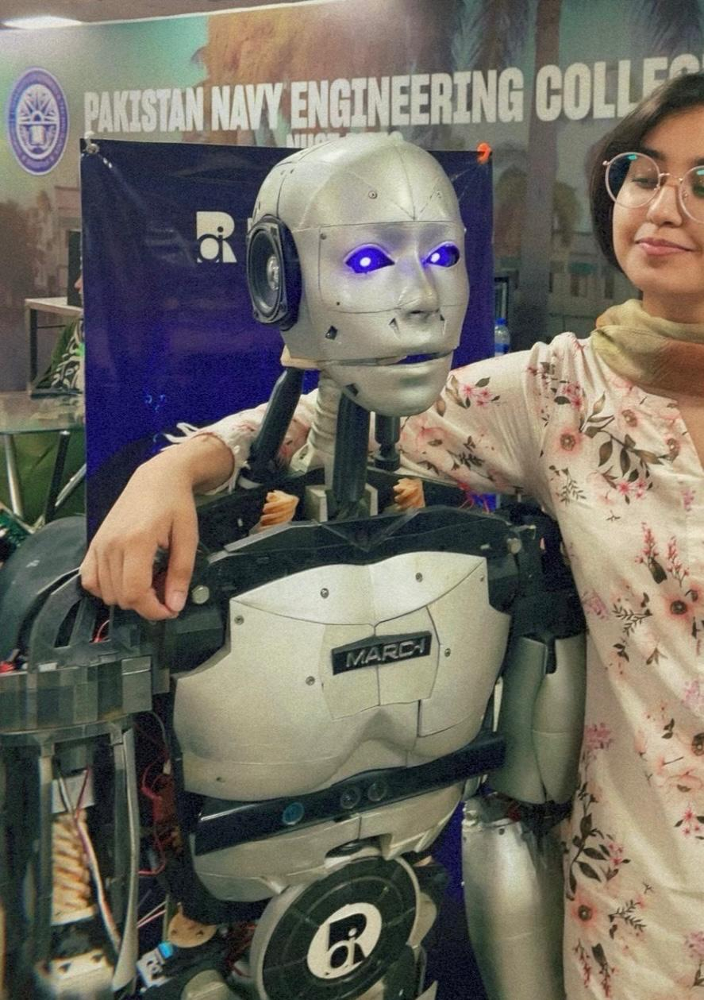
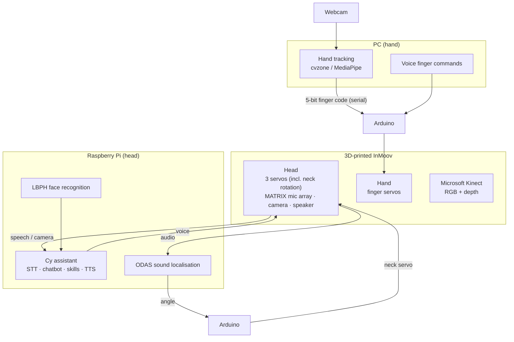

# InMoov Humanoid Robot

**A life-size, 3D-printed [InMoov](https://inmoov.fr/) humanoid built by students of the NUST Robotics and AI society. It features Cy, a conversational social-robot head, a robotic hand driven by hand gestures or voice, and a Microsoft Kinect for depth perception.**

[-orange)](https://inmoov.fr/)
[](https://www.python.org/)
[](https://www.arduino.cc/)
[](https://github.com/matrix-io/matrix-creator-hal)

NUST Robotics and AI · Pakistan Navy Engineering College (PNEC), NUST · 2022–2023

<div align="center">
  
  <br><em>The completed robot at Pakistan Navy Engineering College. The head is Cy, with glowing eyes and a speaker in the ear; the Microsoft Kinect is the black sensor bar below the chest.</em>
</div>

---

## Overview

[InMoov](https://inmoov.fr/), designed by Gaël Langevin, is an open-source humanoid robot that can be built entirely with a hobby 3D printer. We printed and assembled the robot, then gave it its own software:

| Subsystem | What it does | Folder |
|---|---|---|
| **Head: Cy** | A social robot that talks with people, recognises known faces, answers questions, controls lab lights and fans by voice, and turns toward whoever is speaking (sound localisation) | [`head/`](head/) |
| **Hand** | Fingers mirror the operator's hand in real time (webcam hand tracking), or follow spoken commands such as "open index" | [`hand/`](hand/) |
| **Voice chat** | Ask anything aloud; an OpenAI GPT model answers and the robot speaks the reply | [`voice/`](voice/) |
| **Depth perception** | A Microsoft Kinect for depth estimation | (see [Kinect](#microsoft-kinect)) |

---

## System Architecture



---

## Repository Structure

```
InMoov-Humanoid-Robot/
├── head/                 # Cy, the robot head (full docs: head/README.md)
│   ├── cy(tf-lstm).py, cy(dialogpt).py, cy(conv-ai).py   # assistant with 3 conversation back ends
│   ├── features/         # skills: weather, news, Wikipedia, Google, location, date/time, lab automation
│   ├── admin.py          # enrol faces and train the LBPH recogniser
│   ├── data/             # face-recognition and LSTM-intent data and models
│   ├── matrix-odas.cpp, array_move.py, DOA_demo commands  # sound localisation → neck
│   └── Arduino/testing/testing.ino                        # neck servo sketch
├── hand/
│   ├── gesture_control.py   # webcam hand tracking → finger servos
│   ├── handgesture.py       # gesture or voice ("open index", "close all") → finger servos
│   └── STT.py               # speech-to-text helper used by handgesture.py
├── voice/
│   └── OpenAI.py            # speech → OpenAI GPT → spoken answer
├── experiments/
│   └── ros_maze/            # unrelated ROS 1 maze-escape exercise (laser scanner robot)
└── docs/images/             # photos
```

---

## Head: Cy

Cy (pronounced "Sai") is a voice assistant and social robot running on a Raspberry Pi in the head. Full documentation is in **[head/README.md](head/README.md)**. In short:

- **Conversation:** Google speech-to-text, then one of three "brains" (a custom LSTM intent model, Microsoft DialoGPT, or ConvAI), then text-to-speech.
- **Skills:** date and time, weather, Wikipedia, news, Google search, maths and general questions (Wolfram Alpha), and location.
- **Face recognition:** OpenCV LBPH; greets enrolled society members by name.
- **Lab automation:** lights and fans via ThingSpeak.
- **Sound localisation:** a MATRIX Creator 8-mic array with [ODAS](https://github.com/introlab/odas). The LED ring points to the speaker, and the neck servo turns the head toward them.

The head has **three servos**; the code in this repository drives the **neck rotation** servo (Arduino pin 9, 115200 baud).

---

## Hand

The hand's five fingers are driven by servos from an Arduino. The PC sends a single character over serial (9600 baud) encoding which fingers are open.

**Encoding.** Finger states are read in the order [thumb, index, middle, ring, pinky], with 1 = open and 0 = closed. The 5-bit pattern is a number *n* from 0 to 31, sent as:

| *n* | Character | Example |
|---|---|---|
| 0–25 | `A`–`Z` | `00000` (fist) → `A`, `01000` (index only) → `I` |
| 26–31 | `1`–`6` | `11111` (open hand) → `6` |

### Gesture control (mirror the operator's hand)

```bash
pip install cvzone mediapipe opencv-python pyserial
python hand/gesture_control.py      # serial port COM6 in the script; change for your system
```

A webcam tracks one hand with cvzone (MediaPipe, detection confidence 0.7). Every frame, `fingersUp()` gives the five finger states, which are sent as the character above, so the robot hand copies the operator's hand.

### Voice or gesture control

```bash
pip install SpeechRecognition PyAudio
python hand/handgesture.py          # asks whether to use speech recognition
```

In voice mode, a sentence such as **"open index and middle"** or **"close all"** is decoded into finger states and sent the same way (COM5).

---

## Voice Chat (OpenAI)

```bash
pip install SpeechRecognition PyAudio pyttsx3 openai==0.28
export OPENAI_API_KEY=sk-...        # your key
python voice/OpenAI.py
```

The script listens, transcribes with Google speech-to-text, gets a reply from OpenAI's `text-davinci-003` completion model (the GPT model available in 2023), and speaks it with pyttsx3.

---

## Microsoft Kinect

The robot carries a **Microsoft Kinect** for **depth estimation**: an RGB camera plus an infrared depth sensor. It gives the robot a 3D view of the person or scene in front of it. The Kinect software was not part of the repositories merged here, so it is not included.

---

## Hardware Summary

| Part | Used for |
|---|---|
| 3D-printed InMoov parts | Head, torso, arms and hand |
| Raspberry Pi | Cy: voice, face recognition, sound localisation |
| MATRIX Creator | 8-mic array + LED ring for sound localisation |
| Arduino (×2 roles) | Neck servo; finger servos |
| Servos | 3 in the head (incl. neck rotation); one per finger in the hand |
| USB camera / webcam | Face recognition; hand tracking |
| Microsoft Kinect | Depth estimation |
| Speaker, microphone | Voice interaction |

---

## Known Issues

- **Hand voice mode:** `decode_sentence()` in `hand/handgesture.py` uses `range(my_sentence_arr)` (should be `range(len(my_sentence_arr))`), and `my_data_arr[1, 1, 1, 1, 1]` (should be an assignment). As written, voice commands raise an error. Also, `bool(input(...))` is `True` for any non-empty answer, so typing "N" still selects speech mode.
- **Head following:** `head/array_move.py` reads the speaker's angle but sends a fixed `"0"` to the Arduino. See [head/README.md](head/README.md) for this and other head-specific notes.
- **Serial ports** are hard-coded (`COM5`, `COM6`, `/dev/ttyACM1`); change them for your setup.
- **Missing pieces:** the Arduino sketch that drives the finger servos, the code for the other two head servos, and the Kinect software are not in this repository.
- **Old OpenAI API:** `voice/OpenAI.py` uses the pre-1.0 `openai` library (`openai.Completion`) and `text-davinci-003`, which OpenAI has since retired. Install `openai==0.28` and switch to a current model to run it.

---

## History

This repository merges three earlier repositories, each focused on one part of the robot. Their full commit history (March 2023) is preserved here, with files moved into their folders:

| Original repository | Now in |
|---|---|
| `Cy-The-Robot-Head` | `head/` |
| `Robotic-Arm` | `hand/gesture_control.py` |
| `RAI` | `hand/handgesture.py`, `hand/STT.py`, `voice/OpenAI.py`, `experiments/ros_maze/` |

The OpenAI API key that was committed in `RAI` was removed from the imported history and replaced with the `OPENAI_API_KEY` environment variable.

---

## Team

Built by students of the **NUST Robotics and AI** society at Pakistan Navy Engineering College (PNEC), National University of Sciences and Technology (NUST), 2022–2023.

---

## Acknowledgements

- **[InMoov](https://inmoov.fr/)** by Gaël Langevin: the open-source 3D-printed humanoid this robot is built from.
- **[ODAS](https://github.com/introlab/odas)** (IntRoLab), **[MATRIX HAL](https://github.com/matrix-io/matrix-creator-hal)**, **[cvzone](https://github.com/cvzone/cvzone)** / **[MediaPipe](https://developers.google.com/mediapipe)**, **[OpenCV](https://opencv.org/)**, **[DialoGPT](https://github.com/microsoft/DialoGPT)**, **[OpenAI](https://openai.com/)**, **[Wolfram Alpha](https://www.wolframalpha.com/)**, **[ThingSpeak](https://thingspeak.com/)**.
