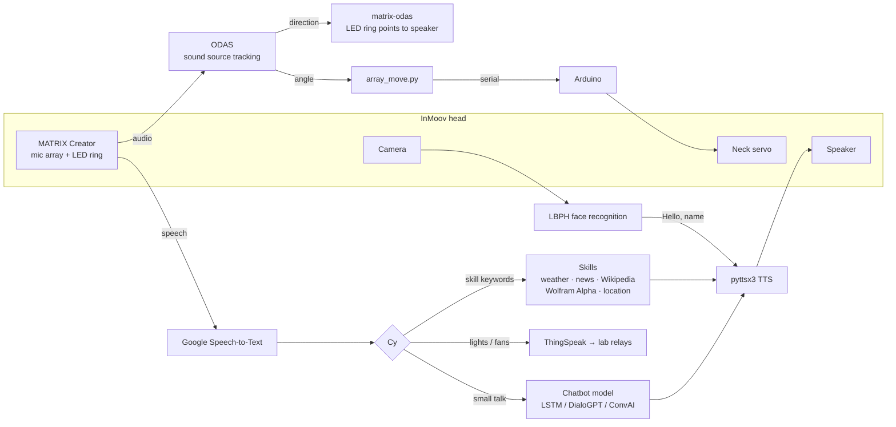

# Cy: The Robot Head

**A conversational social-robot head built on the open-source [InMoov](https://inmoov.fr/) humanoid. Cy (pronounced "Sai") talks with people, recognises known faces, answers questions, controls lab lights and fans by voice, and turns its head toward whoever is speaking.**

[](https://www.python.org/)
[](https://www.matrix.one/)
[](https://www.arduino.cc/)
[](https://inmoov.fr/)

NUST Robotics and AI · Pakistan Navy Engineering College (PNEC), NUST · 2022–2023

---

## Overview

[InMoov](https://inmoov.fr/), by Gaël Langevin, is an open-source, life-size, 3D-printable humanoid robot. Cy is the **head** of an InMoov, turned into a general-purpose **social robot** for the NUST Robotics and AI society. It combines:

- **Conversation:** speech-to-text, a chatbot "brain" (three interchangeable versions) and text-to-speech.
- **Skills:** date and time, weather, Wikipedia, news headlines, Google search, maths and general questions (Wolfram Alpha), and locations and distances.
- **Face recognition:** greets enrolled society members by name.
- **Lab automation:** switches lab lights and fans by voice through ThingSpeak.
- **Sound localisation:** a MATRIX microphone array finds the direction of the speaker. The LED ring lights up toward them, and a neck servo turns the head to face them.

---

## System Architecture



**Hardware:**

| Part | Role |
|---|---|
| 3D-printed InMoov head | Mechanical structure |
| Raspberry Pi | Runs Cy, ODAS and face recognition |
| MATRIX Creator (also supports MATRIX Voice) | 8-mic array for sound localisation; LED ring for direction feedback |
| Arduino + servo (pin 9) | Neck rotation toward the speaker (115200 baud serial) |
| USB camera | Face recognition |
| Speaker | Voice output |

---

## The Three Versions of Cy

All three share the same skills, face recognition and voice pipeline. They differ only in the model used for open-ended conversation:

| Script | Conversation model | TTS backend | Intended platform |
|---|---|---|---|
| `cy(tf-lstm).py` | Custom **LSTM intent classifier** (TensorFlow/Keras) trained on `data/tf-lstm/intents.json` | `espeak` | Raspberry Pi / Linux |
| `cy(dialogpt).py` | **Microsoft DialoGPT-small** (Hugging Face Transformers) | `sapi5` | Windows |
| `cy(conv-ai).py` | **ConvAI GPT model** (Simple Transformers); needs a trained model in `data/conv-ai/` (not included) | `sapi5` | Windows |

The LSTM version answers from 17 intents, including greetings, jokes, riddles, identity ("Who are you?"), creator, age and suggestions. Anything that doesn't match a skill keyword goes to the conversation model.

### Voice commands

| Say something like… | Cy does |
|---|---|
| "What's the **date**?" / "What **time** is it?" | Tells the date or time |
| "What's the **weather** in Karachi?" | Current weather (OpenWeatherMap) |
| "**Tell me about** Alan Turing" | Reads a Wikipedia summary |
| "Read me the **news** / **headlines**" | Reads the top headlines (NewsAPI) |
| "**Google** robotics competitions" | Opens Chrome and runs a Google search (Selenium) |
| "**Calculate** 25 times 4" / "**What is** the speed of light?" / "**Who is**…" | Answers via Wolfram Alpha |
| "**Where is** Lahore?" / "**Where am I**?" | Location and distance from you |
| "Turn the **lights** on" / "Turn the **fans** off" | Switches lab devices via ThingSpeak |
| "**Exit**" | Goes offline |

---

## Repository Structure

```
├── cy(tf-lstm).py, cy(dialogpt).py, cy(conv-ai).py   # Main assistant (three conversation back ends)
├── features/                 # Skills: date_time, weather, wikipedia, news, google_search, loc, lab_automation
├── admin.py                  # Face-recognition admin: check camera, enrol members, view members, retrain
├── data/
│   ├── facial_recognition/   # Haar cascade, LBPH model (model.yml), member list, enrolment images
│   └── tf-lstm/              # intents.json, training.py, trained Keras model
├── matrix-odas.cpp           # Reads ODAS sound-source tracking; lights the MATRIX LED ring toward the speaker
├── odas                      # ODAS (introlab/odas) checkout used on the Pi
├── DOA_demo commands         # Commands to start direction-of-arrival tracking
├── array_move.py             # Sends the speaker's angle to the Arduino over serial
├── Arduino/testing/testing.ino   # Receives an angle over serial and drives the neck servo
├── automation testing/       # Stand-alone ThingSpeak lab-automation tests
├── chatbot-main/             # Earlier prototype: ConvAI chatbot + face_recognition library greeter
├── cam_test.py               # Camera check on the Pi
├── test/                     # Copies of the assistant used for testing
└── requirements.txt
```

---

## Setup

### 1. Python environment

```bash
python -m venv venv && source venv/bin/activate      # Windows: venv\Scripts\activate
pip install -r requirements.txt
pip install opencv-contrib-python tensorflow pyttsx3 SpeechRecognition PyAudio wolframalpha pyserial selenium
pip install transformers torch           # for cy(dialogpt).py
pip install simpletransformers           # for cy(conv-ai).py
sudo apt install espeak portaudio19-dev  # Raspberry Pi / Linux
```

`opencv-contrib-python` is required for the LBPH face recogniser (`cv2.face`). The Google skill also needs Chrome and a matching [ChromeDriver](https://chromedriver.chromium.org/).

### 2. API keys

The skills call external services. Set your own keys in the code before running:
- **Wolfram Alpha** app ID: `wolframalpha.Client(...)` in the `cy(*).py` scripts
- **ThingSpeak** channel write keys: `features/lab_automation.py`
- **OpenWeatherMap** key: `features/weather.py`
- **NewsAPI** key: `features/news.py`

### 3. Enrol faces

```bash
python admin.py
```

The menu lets you **check the camera**, **add a member** (captures face images into `data/facial_recognition/faces/<name>_<CMS ID>/` and adds them to `member_details.csv`), **view members**, and **retrain** the LBPH model (`model.yml`).

### 4. Run Cy

```bash
python "cy(tf-lstm).py"            # voice mode (default)
python "cy(tf-lstm).py" --speech   # typed-text mode (the flag turns speech OFF)
```

Cy starts face recognition in a background thread. When the LBPH match distance for an enrolled member is below 70 (the code checks `100 − distance > 30`), it greets them by name. It then listens for commands.

### 5. Sound localisation and head movement (Raspberry Pi + MATRIX Creator)

1. Install [MATRIX HAL](https://github.com/matrix-io/matrix-creator-hal) and build [ODAS](https://github.com/introlab/odas) on the Pi.
2. Build `matrix-odas.cpp` against MATRIX HAL. It listens on port 9001 for ODAS tracking output and lights the LED ring toward the active sound source.
3. Start tracking (from `odas/bin`, see `DOA_demo commands`):

   ```bash
   ./matrix-odas &
   ./odaslive -vc ../config/matrix-demo/matrix_creator.cfg
   ```
4. Upload `Arduino/testing/testing.ino` (servo on pin 9). Run `array_move.py` to send the speaker's angle to the Arduino over serial (`/dev/ttyACM1`, 115200 baud).

---

## Known Limitations

- `array_move.py` reads the angle from `/home/pi/odas/bin/angle.txt`, but currently sends a fixed `"0"` to the Arduino. To make the head follow the speaker, send `angle` instead.
- `features/weather.py` uses the Wolfram Alpha app ID as its OpenWeatherMap key, so the weather skill fails until a real OpenWeatherMap key is set.
- `demos/head_movement.py` and `demos/lab_automation_demo.py` are empty placeholders.
- `odas` is recorded as a git link without a `.gitmodules` entry, so it is not cloned. Get ODAS from [introlab/odas](https://github.com/introlab/odas).
- The ConvAI model files (`data/conv-ai/`) are not included.
- `pyttsx3` uses `sapi5` (Windows) in the DialoGPT and ConvAI versions and `espeak` (Linux) in the LSTM version. Change the `pyttsx3.init(...)` argument to run them elsewhere.

---

## Team

Developed by students of the **NUST Robotics and AI** society at Pakistan Navy Engineering College (PNEC), National University of Sciences and Technology (NUST), 2022–2023.

---

## Acknowledgements

- **[InMoov](https://inmoov.fr/)** by Gaël Langevin: the open-source 3D-printed humanoid whose head Cy is built on.
- **[ODAS](https://github.com/introlab/odas)** by IntRoLab, Université de Sherbrooke: sound source localisation and tracking.
- **[MATRIX Creator / HAL](https://github.com/matrix-io/matrix-creator-hal)**: microphone array and LED ring.
- **[DialoGPT](https://github.com/microsoft/DialoGPT)** (Microsoft), **[Simple Transformers](https://simpletransformers.ai/)**, **[OpenCV](https://opencv.org/)**, **[Wolfram Alpha](https://www.wolframalpha.com/)**, **[ThingSpeak](https://thingspeak.com/)**.
